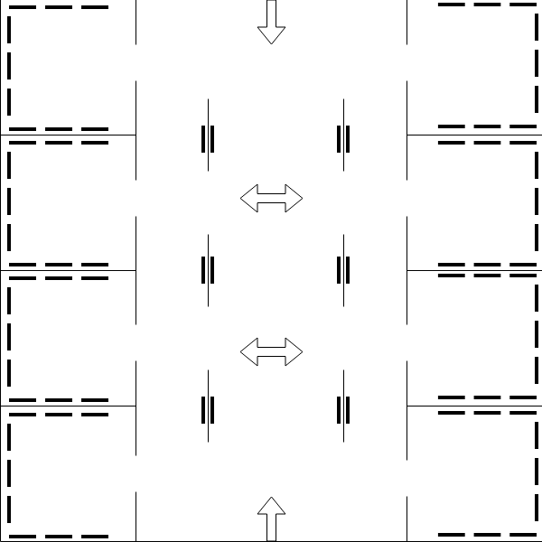

Layout
======

- __Bold__ lines represent posters/presentations/booths
- Arrows represent starting positions and facing directions

## Rationale
- Demonstrate popularity of a project based on number of people around it
- Location should not be a factor (eg. those closer to the entrances attract more people)
- Open-ness to promote interaction between people
- Walls only to provide visual indication of categories